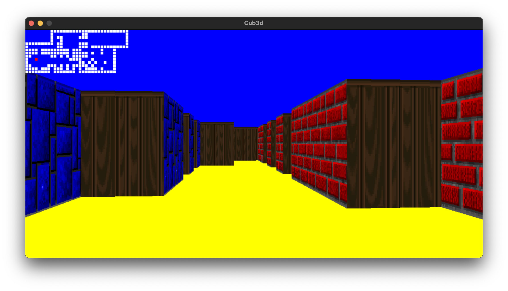

# Cub3D
This repo provides a program that creates a dynamic view inside a maze using [ray casting](https://en.wikipedia.org/wiki/Ray_casting).



Tested on macOS Monterey.

## Installation

#### 1) Clone this repository 
```
git clone git@github.com:JL1709/Cub3D.git
```

#### 2) Execute Makfile
```
cd Cub3D
make
```

#### 3)  Run program
```
./Cub3D map/rc.cub
```
Press/hold:
- a - move to the left
- d - move to the right
- w - move foreward
- s - move backwards
- ← - rotate to the left
- → - rotate to the right
- Rotate the point of view with the mouse

